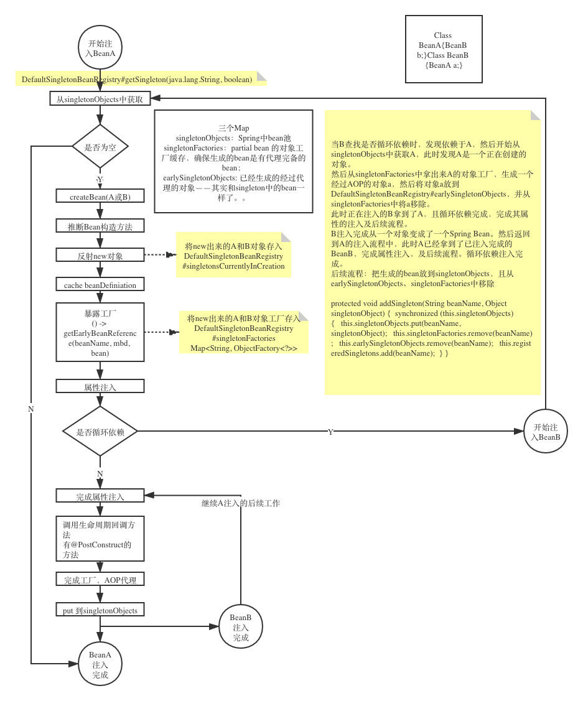

# Learning Source Docs

## 破口清单

> 源码学习的入口，学习spring源码，从下面所列开始学习
- ApplicationContext
- AnnotationConfigApplicationContext
- ClassPathXmlApplicationContext
- 依赖注入

## AnnotationConfigApplicationContext

从构造方法入手，具体看源码注释。

## 依赖注入
主要参考 https://blog.csdn.net/java_lyvee/article/details/101793774

使用构造方法注入，依赖注入会失败。

> https://docs.spring.io/spring/docs/5.2.3.BUILD-SNAPSHOT/spring-framework-reference/core.html#beans-constructor-injection
>
> Circular dependencies
>
> If you use predominantly constructor injection, it is possible to create an unresolvable circular dependency scenario.
>
> For example: Class A requires an instance of class B through constructor injection, and class B requires an instance of class A through constructor injection. If you configure beans for classes A and B to be injected into each other, the Spring IoC container detects this circular reference at runtime, and throws a `BeanCurrentlyInCreationException`.
>
> One possible solution is to edit the source code of some classes to be configured by setters rather than constructors. Alternatively, avoid constructor injection and use setter injection only. In other words, although it is not recommended, you can configure circular dependencies with setter injection.
>
> Unlike the typical case (with no circular dependencies), a circular dependency between bean A and bean B forces one of the beans to be injected into the other prior to being fully initialized itself (a classic chicken-and-egg scenario).

* 流程图(待完善)

  