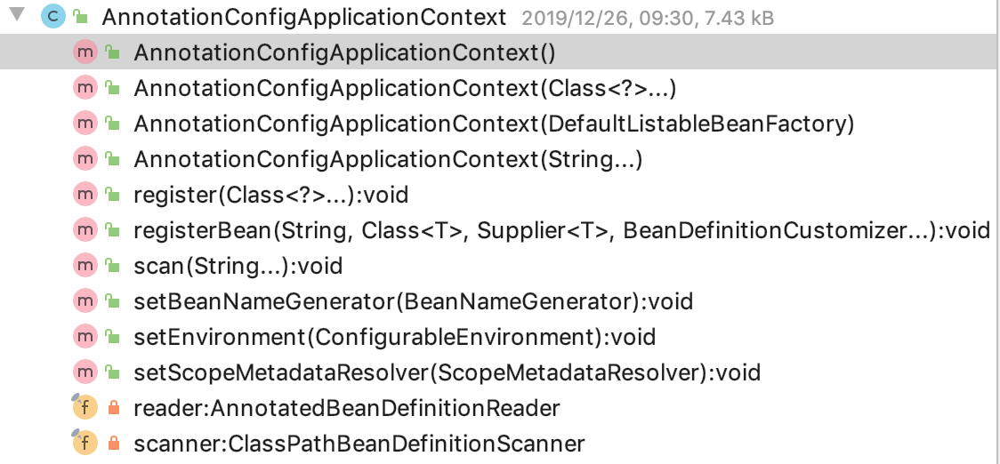

# Learning Source Docs

## 破口清单

> 源码学习的入口，学习spring源码，从下面所列开始学习
- ApplicationContext
- AnnotationConfigApplicationContext
- ClassPathXmlApplicationContext
- 依赖注入

## AnnotationConfigApplicationContext

从构造方法入手，具体看源码注释。

## 依赖注入
使用构造方法注入，依赖注入失败？！待确定